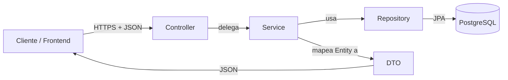
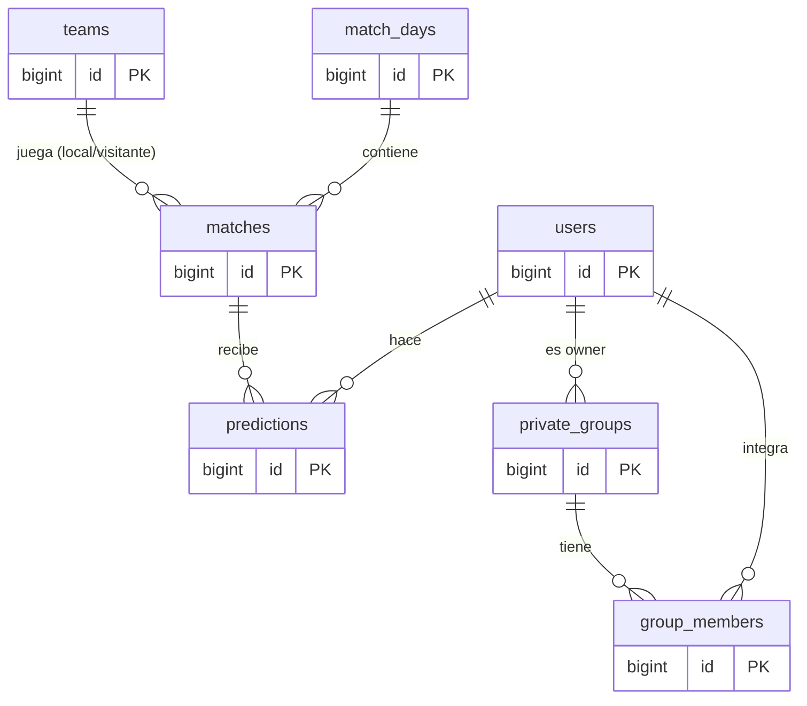

# Prode UTN — Documentación Técnica y Funcional

**TPI Programación 4 — UTN FRVM**

Backend de una plataforma de **Prode** (pronósticos deportivos): API REST que da soporte a la gestión de equipos, fechas, partidos, pronósticos, ranking y grupos privados, con seguridad JWT + BCrypt + HTTPS. Incluye un frontend React (opcional, suma a la rúbrica).

> Esta documentación acompaña al código del repositorio. El equipo mantiene además una bóveda de estudio en Obsidian con el detalle nota por nota.

---

## 1. Stack técnico

| Capa | Tecnología |
|---|---|
| Lenguaje / Framework | Java 21 · Spring Boot 3.4.12 · Maven (wrapper incluido) |
| Persistencia | Spring Data JPA / Hibernate · **PostgreSQL** (`prode_db`) |
| Seguridad | Spring Security · **JWT** (stateless) · **BCrypt** · **HTTPS/TLS** |
| Frontend (opcional) | React 19 · Vite · React Router |

---

## 2. Cómo ejecutar

### Requisitos
- Java 21, Node.js, y **PostgreSQL** con una base `prode_db` creada.
- Variables de entorno en `prode/prode/.env` (hay un `prode/prode/.env.example` de plantilla):
  `DB_URL`, `DB_USERNAME`, `DB_PASSWORD`, `JWT_SECRET`, `JWT_EXPIRATION_MS`, `APP_ADMIN_USERNAME`, `APP_ADMIN_EMAIL`, `APP_ADMIN_PASSWORD`.

### Backend
```bash
cd prode/prode
./mvnw spring-boot:run        # Windows: .\mvnw.cmd spring-boot:run
```
Queda escuchando en **`http://localhost:8080`** (HTTP local por defecto).
Verificación: `GET http://localhost:8080/api/health` → `{"status":"OK"}`.

> **HTTPS (RNF1):** está **desactivado por defecto** y se activa por variables de entorno, **sin versionar ninguna clave** (ningún `.p12` va al repositorio). Ver la subsección *HTTPS local (RNF1)* al final de esta sección.

### Frontend (opcional)
```bash
cd prode/frontend
npm install
npm run dev                   # http://localhost:5173 (o 5174)
```
El frontend lee `VITE_API_URL` desde `prode/frontend/.env`.

### Tests
```bash
cd prode/prode
./mvnw test                   # 80 tests (JUnit 5 + Mockito)
```

### HTTPS local (RNF1)

Por seguridad, **el repositorio no versiona ningún keystore ni clave privada** (`*.p12`, `*.jks`, `*.key`, `*.pem` y `prode/prode/certs/` están en `.gitignore`). HTTPS está **desactivado por defecto** (HTTP local) y se activa por variables de entorno.

Para correr con HTTPS en local, cada desarrollador **genera su propio keystore** (no se comparte ni se sube):

```powershell
mkdir prode\prode\certs

keytool -genkeypair `
  -alias prode `
  -keyalg RSA `
  -keysize 2048 `
  -storetype PKCS12 `
  -keystore prode\prode\certs\prode-keystore.p12 `
  -validity 365 `
  -dname "CN=localhost, OU=UTN, O=Prode, L=Villa Maria, ST=Cordoba, C=AR"
```

Luego, en `prode/prode/.env` (o variables del sistema):

```env
SSL_ENABLED=true
SSL_KEYSTORE_PATH=file:./certs/prode-keystore.p12
SSL_KEYSTORE_PASSWORD=la-clave-que-elegiste-al-generar
SSL_KEY_ALIAS=prode
SERVER_PORT=8443
```

Con eso el backend levanta por HTTPS en `https://localhost:8443` (y el frontend debe apuntar a esa URL). El certificado autofirmado obliga a aceptarlo una vez en el navegador / Postman.

> **Producción:** no se usan certificados autofirmados. Se recomienda **TLS real** (certificado emitido por una CA) o **terminación HTTPS en un proxy / load balancer** (Nginx, Traefik, etc.) delante de la aplicación.

---

## 3. Arquitectura

API REST **en capas**, organizada **por módulos de dominio** (cada módulo es una rebanada vertical controller → service → repository → entity/dto).



| Capa | Responsabilidad |
|---|---|
| **Controller** | Recibe HTTP, valida el body (`@Valid`), aplica autorización (`@PreAuthorize`). Sin lógica de negocio. |
| **Service** | Reglas de negocio, validaciones de dominio, transacciones (`@Transactional`), mapeo a DTO. |
| **Repository** | Acceso a datos con Spring Data JPA. |
| **Entity / DTO** | Las entidades modelan las tablas; **nunca** se exponen al cliente: se mapean a DTOs (`record`). |

**Módulos** (`ar.edu.utn.frvm.prode`): `auth`, `user`, `team`, `matchday`, `match`, `prediction`, `ranking`, `group`, `security`, `config`, `common`, `seed` y `tournament` (funcionalidad adicional).

---

## 4. Modelo de datos



Resumen de cada tabla:
- **users**: `id`, `username` (único), `email` (único), `password` (hash BCrypt), `role` (USER/ADMIN).
- **teams**: `id`, `name` (único).
- **match_days**: `id`, `name` (único), `status` (PROGRAMADA/EN_JUEGO/FINALIZADA, calculado).
- **matches**: `id`, FK a fecha y a dos equipos, `start_time`, `status`, `home_goals`, `away_goals`, `result_trend`.
- **predictions**: `id`, FK a usuario y partido, `predicted_home_goals`, `predicted_away_goals`, `predicted_trend`, `points`, `exact_hit`, `created_at`.
- **private_groups**: `id`, `name`, `invite_code` (único), FK owner.
- **group_members**: une `private_groups` con `users`.

> Restricción clave: `predictions` tiene índice **único compuesto `(user_id, match_id)`** (un pronóstico por usuario y partido).
> Las fechas/horarios se almacenan y comparan en **UTC** (`Instant`), según RNF2.

---

## 5. Seguridad

- **Autenticación stateless con JWT.** En el login se validan credenciales con `AuthenticationManager` (BCrypt) y se emite un token firmado. En cada request, `JwtAuthenticationFilter` valida el token y carga al usuario en el contexto solo para esa petición.
- **Contraseñas con BCrypt** (sal automática); nunca en texto plano (RNF1).
- **Roles** `USER` / `ADMIN` aplicados con `@PreAuthorize` (`hasRole('ADMIN')` en endpoints administrativos).
- **HTTPS/TLS** habilitado (`server.ssl.*` + keystore PKCS12); el servidor rechaza HTTP plano (RNF1).
- Primer admin creado por `DataSeeder` al arrancar (desde el `.env`); no hay endpoint para crear admins.

---

## 6. Reglas de negocio críticas

1. **Bloqueo de pronósticos 30 min antes.** No se puede crear/modificar un pronóstico desde `inicio_partido − 30 min`. La hora la toma el **servidor** (`Instant.now()`), nunca el cliente.
2. **Transición de estados de partido** (`POR_JUGARSE → EN_JUEGO → FINALIZADO`): solo ADMIN. El resultado se carga solo con el partido `EN_JUEGO`; al cargarlo pasa a `FINALIZADO` y se **calculan los puntos** automáticamente. El estado de la **Fecha** se recalcula solo (`PROGRAMADA` / `EN_JUEGO` / `FINALIZADA`).
3. **Privacidad:** un usuario no ve los pronósticos ajenos de un partido hasta que venció su margen de bloqueo.
4. **Motor de puntos:** `3` (marcador exacto), `1` (acierta tendencia Local/Empate/Visitante), `0` (no acierta).

---

## 7. Cumplimiento de la consigna (RF / RNF)

Estado: **cumple el 100%** de los requerimientos del backend.

| Requerimiento | Estado | Dónde |
|---|---|---|
| Regla: bloqueo 30 min (hora del servidor) | ✅ | `PredictionService.validatePredictionWindow` |
| Regla: estados de partido + carga de resultado (solo ADMIN) | ✅ | `MatchService.startMatch` / `loadResult` |
| Regla: privacidad de pronósticos | ✅ | `PredictionService.validatePredictionsAreVisible` |
| **RF1** Auth: registro, login JWT, roles USER/ADMIN | ✅ | `auth`, `security` |
| **RF2** Equipos: alta, listar+buscar, borrar con integridad | ✅ | `TeamService` |
| **RF3** Fechas: nombre único, estado automático, filtro, borrado restringido | ✅ | `MatchDayService` |
| **RF4** Partidos: equipos distintos, estados, start, filtro+orden, borrado | ✅ | `MatchService` |
| **RF5** Pronósticos: upsert único (user+partido), propios por estado, ajenos tras cierre | ✅ | `PredictionService` |
| **RF6** Carga de resultado → tendencia → finalizado + motor 3/1/0 | ✅ | `MatchService.loadResult` + `PredictionScoringService` |
| **RF7** Ranking global + desempate (exactos → pronóstico más antiguo) | ✅ | `RankingService` |
| **RF8** Grupos privados: crear, código único, unirse, ranking del grupo | ✅ | `GroupService` |
| **RNF1** Hash seguro (BCrypt) + HTTPS (TLS configurable) | ✅ | `SecurityConfig` + `server.ssl.*` (HTTPS activable por env; el keystore **no se versiona**) |
| **RNF2** Integridad temporal en UTC | ✅ | `Instant` en todo el código |

---

## 8. Referencia de la API

Base: `http://localhost:8080` (o `https://localhost:8443` con HTTPS local activado). Salvo registro/login/health, todos requieren header `Authorization: Bearer <token>`.

### Auth
| Método | Endpoint | Rol | Body |
|---|---|---|---|
| POST | `/api/auth/register` | público | `{ "username", "email", "password" }` |
| POST | `/api/auth/login` | público | `{ "usernameOrEmail", "password" }` → `{ token }` |
| GET | `/api/auth/me` | autenticado | — |

### Equipos
| Método | Endpoint | Rol | Body |
|---|---|---|---|
| POST | `/api/teams` | ADMIN | `{ "name" }` |
| GET | `/api/teams?name=` | autenticado | — (filtro opcional por nombre) |
| GET | `/api/teams/{id}` | autenticado | — |
| DELETE | `/api/teams/{id}` | ADMIN | — (falla si está en algún partido) |

### Fechas (jornadas)
| Método | Endpoint | Rol | Body |
|---|---|---|---|
| POST | `/api/match-days` | ADMIN | `{ "name" }` |
| GET | `/api/match-days?status=` | autenticado | — (filtro opcional por estado) |
| GET | `/api/match-days/{id}` | autenticado | — |
| PUT | `/api/match-days/{id}` | ADMIN | `{ "name" }` (solo si PROGRAMADA y sin partidos) |
| DELETE | `/api/match-days/{id}` | ADMIN | — (solo si PROGRAMADA y sin partidos) |

### Partidos
| Método | Endpoint | Rol | Body |
|---|---|---|---|
| POST | `/api/matches` | ADMIN | `{ "matchDayId", "homeTeamId", "awayTeamId", "startTime" }` |
| GET | `/api/matches?matchDayId=` | autenticado | — (ordenados por horario) |
| GET | `/api/matches/{id}` | autenticado | — |
| PUT | `/api/matches/{id}` | ADMIN | `{ "homeTeamId", "awayTeamId", "startTime" }` (solo POR_JUGARSE) |
| PATCH | `/api/matches/{id}/start` | ADMIN | — (POR_JUGARSE → EN_JUEGO) |
| PATCH | `/api/matches/{id}/result` | ADMIN | `{ "homeGoals", "awayGoals" }` (EN_JUEGO → FINALIZADO + puntos) |
| DELETE | `/api/matches/{id}` | ADMIN | — (solo POR_JUGARSE y sin pronósticos) |

### Pronósticos
| Método | Endpoint | Rol | Body |
|---|---|---|---|
| POST | `/api/predictions/matches/{matchId}` | USER | `{ "predictedHomeGoals", "predictedAwayGoals" }` |
| GET | `/api/predictions/me?status=` | USER | — (propios, filtro opcional por estado) |
| GET | `/api/predictions/matches/{matchId}` | autenticado | — (de terceros, solo tras el cierre) |

### Ranking
| Método | Endpoint | Rol | Body |
|---|---|---|---|
| GET | `/api/rankings/global` | autenticado | — |

### Grupos privados
| Método | Endpoint | Rol | Body |
|---|---|---|---|
| POST | `/api/groups` | USER | `{ "name" }` → incluye `inviteCode` |
| POST | `/api/groups/join` | USER | `{ "inviteCode" }` |
| GET | `/api/groups/me` | USER | — |
| GET | `/api/groups/{groupId}` | miembro | — |
| GET | `/api/groups/{groupId}/ranking` | miembro | — |
| DELETE | `/api/groups/{groupId}/members/me` | miembro | — (salir del grupo) |

> Una **colección de Postman** lista para importar está en `Prode.postman_collection.json` (guarda el token automáticamente al loguear).

---

## 9. Funcionalidades adicionales (fuera de la consigna)

Como valor agregado, el sistema soporta **múltiples torneos independientes** (formato liga o grupos), con su propia **tabla deportiva** de equipos y una **llave de eliminatorias** (con penales) generada desde esa tabla. Endpoints bajo `/api/tournaments/...` (`/standings`, `/rankings/global`, `/knockout`, etc.). No estaban en la consigna; conviven con el Prode global sin afectarlo.

---

## 10. Resumen de calidad

- **80 tests** (JUnit 5 + Mockito), 0 fallas — incluye un test de carga del contexto Spring completo.
- Manejo de errores centralizado (`@RestControllerAdvice`) con respuestas JSON uniformes y códigos HTTP correctos.
- DTOs inmutables (`record`); entidades nunca expuestas; timestamps automáticos en UTC.
